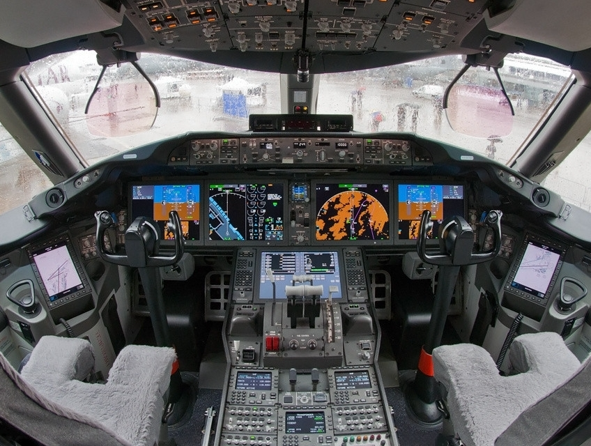

```{r xaringan-themer, include = FALSE, warning = FALSE}
library(xaringanthemer)
style_mono_light(base_color = "#23395b")
```

## What is R?

.middle2[.center[.huge["R is a language and environment for statistical computing and graphics"]<sup>[1]</sup>]]

.footer[.tiny[[1] https://www.r-project.org/about.html]]

--

.middle2[.center[.huge["R is a .orange[language] and environment for statistical computing and graphics"]<sup>[1]</sup>]]

--

.middle2[.center[.huge["R is a .orange[language] and environment for .orange[statistical] computing and graphics"]<sup>[1]</sup>]]

--

.middle2[.center[.huge["R is a .orange[language] and environment for .orange[statistical] computing and .orange[graphics]"]<sup>[1]</sup>]]

---

## Advantages

.middle2[.center[]]

---

## Advantages

.middle2[

.center[.huge[Reuse your code]]

```{r, echo = FALSE, fig.align = "center", out.width = "40%"}

```

]

---

## Advantages

.middle2[.center[.huge[Make publication-quality plots]]]

---

## Advantages

```{r, echo = FALSE, fig.align = "center", out.width = "100%"}

```
---

## Advantages

```{r, echo = FALSE, fig.align = "center", out.width = "70%"}
knitr::include_graphics("./figs/lineplot.png")
```
---

## Advantages

```{r, echo = FALSE, fig.align = "center", out.width = "60%"}
knitr::include_graphics("./figs/boxplot.png")
```
---

## Advantages

```{r, echo = FALSE, fig.align = "center", out.width = "70%"}
knitr::include_graphics("./figs/regplots.png")
```
---

## Advantages

.center[.huge[Write a paper]]


---

## Advantages

.center[.huge[Write a paper]]


---

## Advantages

.center[.huge[Make presentations]]

```{r, eval = FALSE}
## Advantages

.center[.huge[Write a paper]]


---

## Advantages

.center[.huge[Write a paper]]


---

## Advantages

.center[.huge[Make presentations]]
```

---

## Advantages

.middle2[

```{r, echo = FALSE, fig.align = "center", out.width = "100%"}

```

]

---

## Disadvantages

.middle2[

```{r, echo = FALSE, fig.align = "center", out.width = "100%"}
knitr::include_graphics("./figs/r.png")
```

]

--

.middle2[

```{r, echo = FALSE, fig.align = "center", out.width = "100%"}

```

]

---

## Disadvantages


---

## Disadvantages

.middle2[]

---

## Disadvantages


---

## Disadvantages

.middle2[

```{r, echo = FALSE, fig.align = "center", out.width = "60%"}

```

]

---

## Help

.center[]

--

```{r, echo = FALSE, fig.align = "center", out.width = "80%"}
knitr::include_graphics("./figs/help2.png")
```
