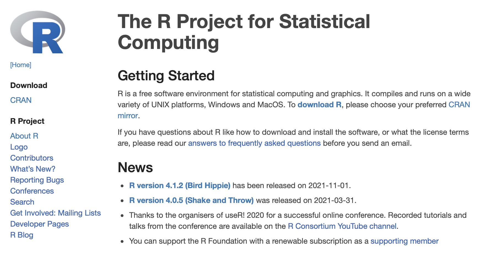

```{r xaringan-themer, include = FALSE, warning = FALSE}
library(xaringanthemer)
style_mono_light(base_color = "#23395b")
```

class: inverse, left, bottom
background-image: url("./figs/logo.png")
background-position: 7% 2%
background-size: 120px 70px

```{r title_fig, dev.args = list(bg = 'transparent'), fig.asp = 3/4, fig.align = 'center', echo = FALSE, out.width = "80%", dpi= 300, warning = FALSE}
library(ggplot2)
library(ggsci)

set.seed(20211111)

x <- c(
  c(rnorm(10, 10, 7), rep(NA, 1e5 - 10)),
  rnorm(1e5),
  c(rnorm(100, -2.5, 5), rep(NA, 1e5 - 100)),
  c(rnorm(1e3, -10, 2), rep(NA, 1e5 - 1e3))
)
y <- c(
  rep("a", 1e5),
  rep("b", 1e5),
  rep("c", 1e5),
  rep("d", 1e5)
)

data.frame(x, y) |>
  ggplot(aes(x = x, color = y)) +
  geom_density() +
  #scale_color_tron() +
  scale_color_manual(
    values = c("#95CC5E", "#FF7E0C", "#D1DEE6", "#F7C531")
  ) +
  theme_void() +
  theme(legend.position = "none")
```

### Statistics with R

#### Lesson 00: Introduction


---

class: inverse, middle, center

# Statistics with R

---

## Statistics with R

.huge[What are you going to learn?]

--

1. Statistical concepts

--

   * What to do

--

   * How to do

--

   * What is behind it

--

2. A (probably) new tool: R

--

   * Free, open source software

---

## Today

<br> 

.huge[
* Why R?
]

--

.huge[
* How to install
]

--

.huge[
* The basics
]

---

class: inverse, middle, center

# Why R?

---

## What is R?

.middle2[.center[.huge["R is a language and environment for statistical computing and graphics"]<sup>[1]</sup>]]

.footer[.tiny[[1] [r-project.org](https://www.r-project.org)]]

--

.middle2[.center[.huge["R is a .orange[language] and environment for statistical computing and graphics"]<sup>[1]</sup>]]

--

.middle2[.center[.huge["R is a .orange[language] and environment for .orange[statistical] computing and graphics"]<sup>[1]</sup>]]

--

.middle2[.center[.huge["R is a .orange[language] and environment for .orange[statistical] computing and .orange[graphics]"]<sup>[1]</sup>]]

---

## Advantages


.center[]

---

## Advantages

.middle2[

.center[.huge[Reuse your code]]

```{r, echo = FALSE, fig.align = "center", out.width = "40%"}
knitr::include_graphics("./figs/recycle.png")
```

]

---

## Advantages

.middle2[.center[.huge[Make publication-quality plots]]]

---

## Advantages

```{r, echo = FALSE, fig.align = "center", out.width = "100%"}
knitr::include_graphics("./figs/bland-altman.png")
```
---

## Advantages

```{r, echo = FALSE, fig.align = "center", out.width = "70%"}

```
---

## Advantages

```{r, echo = FALSE, fig.align = "center", out.width = "60%"}

```
---

## Advantages

```{r, echo = FALSE, fig.align = "center", out.width = "70%"}

```
---

## Advantages

.center[.huge[Write a paper]]


---

## Advantages

.center[.huge[Write a paper]]


---

## Advantages

.center[.huge[Make presentations]]

```{r, eval = FALSE}
## Advantages

.center[.huge[Write a paper]]


---

## Advantages

.center[.huge[Write a paper]]


---

## Advantages

.center[.huge[Make presentations]]
```

---

## Advantages

<br>

```{r, echo = FALSE, fig.align = "center", out.width = "60%"}
knitr::include_graphics("./figs/everything.png")
```

---

## Disadvantages

.middle2[

```{r, echo = FALSE, fig.align = "center", out.width = "100%"}

```

]

--

.middle2[

```{r, echo = FALSE, fig.align = "center", out.width = "100%"}
knitr::include_graphics("./figs/dont_know.png")
```

]

---

## Disadvantages


---

## Disadvantages

<br>

```{r, echo = FALSE, fig.align = "center", out.width = "60%"}
knitr::include_graphics("./figs/cockpit.png")
```

---

## Disadvantages

<br>


---

## Disadvantages

```{r, echo = FALSE, fig.align = "center", out.width = "40%"}
knitr::include_graphics("./figs/no_idea.png")
```

---

## Help

.center[]

--

```{r, echo = FALSE, fig.align = "center", out.width = "80%"}

```

---

class: inverse, middle, center

# Installing R

---

## Installing R

.center[.huge[[r-project.org](https://www.r-project.org)]]

.center[]

---

## Installing R

.center[.huge[[r-project.org](https://www.r-project.org)]]

.center[]

---

## Installing R

.huge[Choose the mirror closest to your location]

.center[]

--

.huge[Select your operating system]

.center[]

---

## Installing R

.huge[For windows]

.center[]

---

## Installing R

.huge[For macOS]

.center[]

---

## Installing

.middle2[.center[.huge[Click on the installer and follow the instructions]]]

---

## R GUI


.middle2[

```{r, echo = FALSE, fig.align = "center", out.width = "100%"}

```

]

---

## Alternatives

.huge[Code editors]

  * .large[VSCode, Emacs, Vim]

--

<br>
<br>

.huge[RStudio IDE]

```{r, echo = FALSE, fig.align = "left", out.width = "40%"}
knitr::include_graphics("./figs/rstudio.png")
```

---

## Installing RStudio

.center[.huge[[rstudio.com](https://www.rstudio.com)]]

.center[]

---

## Installing RStudio

.center[.huge[[rstudio.com](https://www.rstudio.com)]]

.center[]

--

.center[]

---

## Installing RStudio

.center[.huge[Select your operating system]]

.center[]

.center[.huge[Click on the installer and follow the instructions]]

---

## RStudio

.center[]

---

## RStudio

.center[]

---

## RStudio

.center[]

---

## RStudio

.center[]

---

## RStudio

.center[]

---

class: inverse, middle, center

# R Basics

---

## R as a calculator

```{r}
2 + 2
```

---

## R as a calculator

```{r}
2 + 2
5 - 9
```

---

## R as a calculator

```{r}
2 + 2
5 - 9
3 * 7
```

---

## R as a calculator

```{r}
2 + 2
5 - 9
3 * 7
17 / 6
```

---

## R as a calculator

```{r}
2 + 2
5 - 9
3 * 7
17 / 6
4^2 # can be 4**2
```

---

## Everything is an object

```{r}
3
```

---

## Everything is an object

```{r}
3
x <- 3
```

---

## Everything is an object

```{r}
3
x <- 3
x
```

---

## Everything is an object

```{r}
3
x <- 3
x
```

Assignment operator: `<-` preferable over `=`

--

RStudio shortcut: Alt (Option) + -

---

## Object naming

.large[Best practices]<sup>[2]</sup>
.footer[.tiny[[2] [style.tidyverse.org](https://style.tidyverse.org/index.html)]]

Should only use lowercase letters, numbers and underscore (\_)

```{r, eval = FALSE}
# Good
day_one
day_1

# Bad
DayOne
dayone
day.one
```

---

## Object naming

.large[Best practices]<sup>[2]</sup>
.footer[.tiny[[2] [style.tidyverse.org](https://style.tidyverse.org/index.html)]]

Should only use lowercase letters, numbers and underscore (\_)

```{r, eval = FALSE}
# Good
day_one
day_1

# Bad
DayOne
dayone
day.one
```

ATTENTION: R is case sensitive

```{r, error = TRUE}
number_1 <- 1
Number_1
```

---

## Object types

.huge[Numeric]

```{r, eval = FALSE}
1
0
-4
8.72
pi
```

---

## Object types

.huge[Numeric]

```{r, eval = FALSE}
1
0
-4
8.72
pi
```

Obs: `interger` vs. `double`

---

## Object types

.huge[Character]

```{r, eval = FALSE}
"a"
"multipleletters"
"you can use spaces"
"5"
```

---

## Object types

.huge[Logical]

```{r, eval = FALSE}
TRUE
FALSE
```

---

## Logical operators

.large[Test if two values are equal]

```{r, eval = FALSE}
10 == 10
```

---

## Logical operators

.large[Test if two values are equal]

```{r}
10 == 10
```

---

## Logical operators

.large[Test if two values are equal]

```{r}
10 == 10
```

```{r, eval = FALSE}
3 == 10
```

---

## Logical operators

.large[Test if two values are equal]

```{r}
10 == 10
```

```{r}
3 == 10
```

---

## Logical operators

.large[Test if two values are equal]

```{r}
10 == 10
3 == 10
```

```{r, eval = FALSE}
a <- 1
a == 1
```

---

## Logical operators

.large[Test if two values are equal]

```{r}
10 == 10
3 == 10
```

```{r}
a <- 1
a == 1
```

---

## Logical operators

.large[Test if two values are equal]

```{r}
10 == 10
3 == 10
a <- 1
a == 1
```

IMPORTANT: double equal sign `==`

```{r, error = TRUE}
10 = 10
```

---

## Logical operators

.large[Test if a value is greater than or less than another]

```{r, eval = FALSE}
2 > 3
```

---

## Logical operators

.large[Test if a value is greater than or less than another]

```{r}
2 > 3
```

---

## Logical operators

.large[Test if a value is greater than or less than another]

```{r}
2 > 3
```

```{r, eval = FALSE}
2 < 3
```

---

## Logical operators

.large[Test if a value is greater than or less than another]

```{r}
2 > 3
```

```{r}
2 < 3
```

---

## Logical operators

.large[Test if a value is greater than or less than another]

```{r}
2 > 3
```

```{r}
2 < 3
```

```{r, eval = FALSE}
2 < 2
```

---

## Logical operators

.large[Test if a value is greater than or less than another]

```{r}
2 > 3
```

```{r}
2 < 3
```

```{r}
2 < 2
```

---

## Logical operators

.large[Test if a value is greater than or equal to or less than or equal to another]

```{r, eval = FALSE}
3 >= 1
```

---

## Logical operators

.large[Test if a value is greater than or equal to or less than or equal to another]

```{r}
3 >= 1
```

---

## Logical operators

.large[Test if a value is greater than or equal to or less than or equal to another]

```{r}
3 >= 1
```

```{r, eval = FALSE}
3 <= 3
```

---

## Logical operators

.large[Test if a value is greater than or equal to or less than or equal to another]

```{r}
3 >= 1
```

```{r}
3 <= 3
```

---

## Logical operators

.large[Negate an operation]

```{r, eval = FALSE}
10 != 10
```

---

## Logical operators

.large[Negate an operation]

```{r}
10 != 10
```

---

## Logical operators

.large[Negate an operation]

```{r}
10 != 10
```

```{r, eval = FALSE}
!(5 > 9)
```

---

## Logical operators

.large[Negate an operation]

```{r}
10 != 10
```

```{r}
!(5 > 9)
```

---

## Multiple logical operations

* `&` (**and**): is `TRUE` when ALL conditions are `TRUE`

--

* `|` (**or**): is `TRUE` if AT LEAST one condition is `TRUE`

--

```{r, eval = FALSE}
7 <= 7 & 3 != 4
7 < 7 & 3 != 4
7 == 7 & 3 > 4
7 != 7 & 3 == 4
```

---

## Multiple logical operations

* `&` (**and**): is `TRUE` when ALL conditions are `TRUE`


* `|` (**or**): is `TRUE` if AT LEAST one condition is `TRUE`


```{r}
7 <= 7 & 3 != 4
```

```{r, eval = FALSE}
7 < 7 & 3 != 4
7 == 7 & 3 > 4
7 != 7 & 3 == 4
```

---

## Multiple logical operations

* `&` (**and**): is `TRUE` when ALL conditions are `TRUE`


* `|` (**or**): is `TRUE` if AT LEAST one condition is `TRUE`


```{r}
7 <= 7 & 3 != 4
7 < 7 & 3 != 4
```

```{r, eval = FALSE}
7 == 7 & 3 > 4
7 != 7 & 3 == 4
```

---

## Multiple logical operations

* `&` (**and**): is `TRUE` when ALL conditions are `TRUE`


* `|` (**or**): is `TRUE` if AT LEAST one condition is `TRUE`


```{r}
7 <= 7 & 3 != 4
7 < 7 & 3 != 4
7 == 7 & 3 > 4
```

```{r, eval = FALSE}
7 != 7 & 3 == 4
```

---

## Multiple logical operations

* `&` (**and**): is `TRUE` when ALL conditions are `TRUE`


* `|` (**or**): is `TRUE` if AT LEAST one condition is `TRUE`


```{r}
7 <= 7 & 3 != 4
7 < 7 & 3 != 4
7 == 7 & 3 > 4
7 != 7 & 3 == 4
```

---

## Multiple logical operations

* `&` (**and**): is `TRUE` when ALL conditions are `TRUE`


* `|` (**or**): is `TRUE` if AT LEAST one condition is `TRUE`


```{r, eval = FALSE}
-1 > -2 | 9 > 5
-1 <= -2 | 9 != 5
-1 != -2 | 9 >= 5
-1 == -2 | 9 < 5
```

---

## Multiple logical operations

* `&` (**and**): is `TRUE` when ALL conditions are `TRUE`


* `|` (**or**): is `TRUE` if AT LEAST one condition is `TRUE`


```{r}
-1 > -2 | 9 > 5
```

```{r, eval = FALSE}
-1 <= -2 | 9 != 5
-1 != -2 | 9 >= 5
-1 == -2 | 9 < 5
```

---

## Multiple logical operations

* `&` (**and**): is `TRUE` when ALL conditions are `TRUE`


* `|` (**or**): is `TRUE` if AT LEAST one condition is `TRUE`


```{r}
-1 > -2 | 9 > 5
-1 <= -2 | 9 != 5
```

```{r, eval = FALSE}
-1 != -2 | 9 >= 5
-1 == -2 | 9 < 5
```

---

## Multiple logical operations

* `&` (**and**): is `TRUE` when ALL conditions are `TRUE`


* `|` (**or**): is `TRUE` if AT LEAST one condition is `TRUE`


```{r}
-1 > -2 | 9 > 5
-1 <= -2 | 9 != 5
-1 != -2 | 9 >= 5
```

```{r, eval = FALSE}
-1 == -2 | 9 < 5
```

---

## Multiple logical operations

* `&` (**and**): is `TRUE` when ALL conditions are `TRUE`


* `|` (**or**): is `TRUE` if AT LEAST one condition is `TRUE`


```{r}
-1 > -2 | 9 > 5
-1 <= -2 | 9 != 5
-1 != -2 | 9 >= 5
-1 == -2 | 9 < 5
```

---

## Vectors

Untill now, we have operated with vectors of length 1

```{r}
x <- 7
x
```

---

## Vectors

Untill now, we have operated with vectors of length 1

```{r}
x <- 7
x
```

We can assess the length of a vector with the function `length()`

```{r}
length(x)
```

---

## Vectors

We can create vectors with the function `c()`

```{r}
my_vector <- c(1, 1, 8, 3, 5, 20)
my_vector
```

--

```{r}
length(my_vector)
```

--

We can combine vectors to create bigger vectors

```{r}
bigger_vector <- c(my_vector, c(100, 101, 102))
bigger_vector
```

---

## Vectors

Vectors can have elements of different types

```{r}
mixed_vector <- c("word", 9, TRUE)
mixed_vector
```

--

We can access vector elements by position using the `[]` operator

```{r}
char_vector <- c("one", "two", "three")
char_vector[2]
```

--

```{r, error = TRUE}
char_vector[4]
```

---

## Vectors

One of the major benefits of vectors is the concept of **vectorization**

```{r, eval = FALSE}
n <- 1:5
n
```

---

## Vectors

One of the major benefits of vectors is the concept of **vectorization**

```{r}
n <- 1:5
n
```

--

```{r}
n^2
```

--

```{r}
sqrt(n)
sum(n)
```

---

## Data frames

* A list of equal-length vectors: it has a rectangular shape

--

* Each vector is a column

--

* Each column can store only objects with the same type

--

* We can create data frames or import from files

--

* R has some built-in data frames

```{r, eval = FALSE}
iris
```

---

## Data frames

```{r}
str(iris)
```

---

## Data frames

```{r}
head(iris)
```

---

## Data frames

```{r}
head(iris)
tail(iris)
```

---

## Data frames

```{r, eval = FALSE}
names(iris)
nrow(iris)
ncol(iris)
```

---

## Data frames

```{r}
names(iris)
```

```{r, eval = FALSE}
nrow(iris)
ncol(iris)
```

---

## Data frames

```{r}
names(iris)
nrow(iris)
```

```{r, eval = FALSE}
ncol(iris)
```

---

## Data frames

```{r}
names(iris)
nrow(iris)
ncol(iris)
```

---

## Data frames

We can access data frame elements in various ways

--

The `$` operator: select columns

```{r, eval = FALSE}
iris$Sepal.Width
```

---

## Data frames

We can access data frame elements in various ways


The `$` operator: select columns

```{r}
iris$Sepal.Width
```

---

## Data frames

The `[]` operator: select columns and/or rows

Syntax: `data.frame[row, col]`

--

```{r, eval = FALSE}
iris[, 1]
```

---

## Data frames

The `[]` operator: select columns and/or rows

Syntax: `data.frame[row, col]`

```{r}
iris[, 1]
```
---

## Data frames

The `[]` operator: select columns and/or rows

Syntax: `data.frame[row, col]`

```{r}
iris[, "Sepal.Width"]
```

---

## Data frames

The `[]` operator: select columns and/or rows

Syntax: `data.frame[row, col]`

```{r}
iris[1, ]
```

--

```{r}
iris[1, 1]
```

--

```{r}
iris[1, "Sepal.Width"]
```

---

## Functions

"Set of instructions bundled together to achieve a specific outcome"

--

```{r, eval = FALSE}
length()
c()
head()
sum()
```

--

```{r, eval = FALSE}
function_name(arg1 = val1, arg2 = val2, ..., argn = valn)
```

--

```{r, eval = FALSE}
help(length)
```

--

```{r, echo = FALSE, fig.align = "center", out.width = "50%"}

```

---

## Functions

You can define your own functions

--

```{r, eval = FALSE}
my_function <- function(arg_name) {
  do something
}
```

--

```{r}
add_one <- function(x) {
  x + 1
}
```

--

```{r}
add_one(2)
```

--

```{r}
a <- c(1, 3, 5, 7, 9)
add_one(x = a)
```

---

## Packages

* Extensions to the R programming language

--

* Contain code, data and documentation

--

* Most of the code are function definitions

--

* Anyone can develop a package

--

* You can install and load packages to use in your analyses

--

<br>

.center[Installing vs. Loading]

```{r, eval = FALSE}
install.packages("packagename")
library(packagename)
```

---

## Packages

```{r, eval = FALSE}
install.packages("tidyverse")
```

--

```{r}
library(tidyverse)
```

---

## The tibble

```{r}
iris
```

---

## The tibble

```{r}
as_tibble(iris)
```

---

## Workspace

It's where user-defined objects accumulate

--

```{r}
ls()
```

--

<br>

It can get messy

--

* If you quit R

--

* If you have multiple analyses going on

--

* Importing data and exporting output

---

## Workspace

What is real?

--

* Your data?

* Your scripts?

* Your workspace?

* Your outputs?

--

<br>

.center[.huge[Keep your code!]]

---

## Working directory

Where you are

--

```{r, eval = FALSE}
getwd()
```

---

## Working directory

Where you are

```{r}
getwd()
```

--

```{r, eval = FALSE}
setwd("path/to/where/you/choose")
```

--

<br>

**Do not use this!**

--

Use RStudio Projects + `{here}` package

---

## Projects

.center[]

---

## Projects

* Always open RStudio by clicking "my_project.Rproj"

--

* Use the `{here}` package to refer to relative paths inside your project

--

```{r, eval = FALSE}
read_csv(here("data", "raw_data.csv"))
```
--

<br>

**Remember that packages need first to be installed and then loaded into your session**

---

class: inverse, middle, center

# Exercises

---

class: inverse, middle, center
background-image: url("./figs/logo.png")
background-position: 7% 2%
background-size: 120px 70px

.enormous[Thank you!]

<br>

Slides at:

```{r, echo = FALSE, fig.align = "center", out.width = "20%"}
knitr::include_graphics("./figs/qrcode.png")
```

```{r, echo = FALSE}
library(icons)
```

`r icon_style(fontawesome("github"), fill = "white")` @verasls | `r icon_style(fontawesome("twitter"), fill = "white")` @verasls

`r icon_style(fontawesome("envelope", style = "solid"), fill = "white")` lucasdsveras@gmail.com
