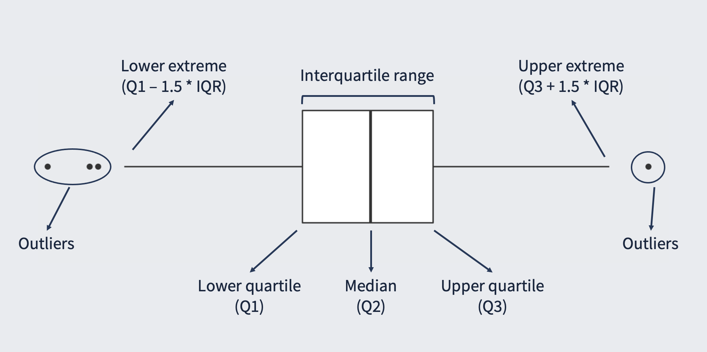

```{r xaringan-themer, include = FALSE, warning = FALSE}
library(xaringanthemer)
style_mono_light(base_color = "#23395b")
```

class: inverse, left, bottom
background-image: url("./figs/logo.png")
background-position: 7% 2%
background-size: 120px 70px

```{r title_fig, echo = FALSE,  dev.args = list(bg = 'transparent'), fig.asp = 3/4, fig.align = 'center', out.width = "80%", dpi= 300, warning = FALSE}
suppressPackageStartupMessages(library(dplyr))
library(ggplot2)
library(ggsci)

set.seed(20220322)

x <- c(
  rnorm(100, 10, 7),
  rnorm(100),
  rnorm(100, -2.5, 5),
  rnorm(100, -10, 2)
)
y <- c(
  rep("a", 100),
  rep("b", 100),
  rep("c", 100),
  rep("d", 100)
)

points <- data.frame(x, y)
summary <- points |>
  group_by(y) |>
  summarise(
    mean = mean(x),
    sd = sd(x)
  ) |>
  mutate(
    lower_ci = mean - 1.96 * sd / sqrt(100),
    upper_ci = mean + 1.96 * sd / sqrt(100)
  )

ggplot() +
  geom_jitter(
    data = points, mapping = aes(x = x, y = y, color = y),
    height = 0.3, alpha = 0.5
  ) +
  geom_boxplot(
    data = points, mapping = aes(x = x, y = y),
    width = 0.2, fill = NA, outlier.shape = NA, color = "white"
  ) +
  geom_point(
    data = summary, mapping = aes(x = mean, y = y),
    size = 2, color = "white"
  ) +
  scale_color_manual(
    values = c("#95CC5E", "#FF7E0C", "#D1DEE6", "#F7C531")
  ) +
  theme_void() +
  theme(legend.position = "none")
```

### Statistics with R

#### Lesson 01: Introduction to statistics

---

## Today

<br> 

.huge[
* Introduction to statistics
]

--

.huge[
* Measures of central tendency and dispersion
]

--

.huge[
* Hypothesis testing
]

---

class: inverse, middle, center

# Introduction to statistics

---

## Population and sample

```{r p1, echo = FALSE, dev.args = list(bg = 'transparent'), fig.asp = 3/4, fig.align = 'center', out.width = "80%", dpi= 300}
library(ggplot2)
library(ggforce)

set.seed(20220321)
x <- c(runif(80, 2, 8))
y <- c(runif(80, 2, 8))

p1 <- data.frame(x, y) |>
  ggplot() +
  scale_x_continuous(limits = c(-1, 10)) +
  scale_y_continuous(limits = c(0, 10)) +
  geom_point(
    aes(x = x, y = y), size = 3, alpha = 0.9, color = "#283858"
  ) +
  coord_fixed() +
  theme_void()
p1
```

---

## Population and sample

```{r p2, echo = FALSE, dev.args = list(bg = 'transparent'), fig.asp = 3/4, fig.align = 'center', out.width = "80%", dpi= 300}
p2 <- p1 +
  geom_circle(aes(x0 = 5, y0 = 5, r = 4)) +
  geom_curve(
    aes(x = 5.2, y = 8.5, xend = 7.5, yend = 9.0),
    arrow = arrow(length = unit(0.03, "npc"))
  ) +
  annotate("text", x = 7.5, y = 9.4, label = "Population", size = 6)
p2
```

---

## Population and sample

```{r p3, echo = FALSE, dev.args = list(bg = 'transparent'), fig.asp = 3/4, fig.align = 'center', out.width = "80%", dpi= 300}
p3 <- p2 +
  geom_circle(aes(x0 = 3, y0 = 6, r = 1), color = "#FF7E0C") +
  geom_curve(
    aes(x = 2.5, y = 5.5, xend = -0.4, yend = 5.0),
    arrow = arrow(length = unit(0.03, "npc")),
    color = "#FF7E0C"
  ) +
  annotate("text", x = -0.4, y = 4.6, label = "Sample", size = 6)
p3
```

---

## Population and sample

.center[]

---

## Frequency distributions

```{r, echo = FALSE, dev.args = list(bg = 'transparent'), fig.asp = 3/4, fig.align = 'center', out.width = "80%", dpi= 300, message = FALSE, warning = FALSE}
set.seed(20220321)
d <- data.frame(x = rnorm(1e4))
ggplot(d, aes(x = x)) +
  geom_histogram(aes(y = ..density..), color = "white", fill = "#283858") +
  stat_function(fun = dnorm, args = list(mean = mean(d$x), sd = sd(d$x))) +
  scale_x_continuous(expand = c(0, 0), limits = c(-4, 4)) +
  theme_void()
```

---

## Frequency distributions

```{r, include = FALSE}
set.seed(20220321)
d <- data.frame(
  p = rbeta(1e4, 1.5, 7),
  n = rbeta(1e4, 5, 2)
)

p <- ggplot(d, aes(x = p)) +
  geom_histogram(aes(y = ..density..), color = "white", fill = "#283858") +
  stat_function(fun = dnorm, args = list(mean = mean(d$x), sd = sd(d$x))) +
  theme_void()

n <- ggplot(d, aes(x = n)) +
  geom_histogram(aes(y = ..density..), color = "white", fill = "#283858") +
  stat_function(fun = dnorm, args = list(mean = mean(d$x), sd = sd(d$x))) +
  theme_void()
```

.pull-left[

```{r, echo = FALSE, dev.args = list(bg = 'transparent'), fig.align = 'center', out.width = "90%", dpi= 300, message = FALSE, warning = FALSE}
p
```

.center[Positively skewed]

]

.pull-right[

```{r, echo = FALSE, dev.args = list(bg = 'transparent'), fig.align = 'center', out.width = "90%", dpi= 300, message = FALSE, warning = FALSE}
n
```

.center[Negatively skewed]

]

---

class: inverse, middle, center

# Measures of central tendency and dispersion

---

class: middle, center

# Central tendency

.large[Indicates the typical or central value in a distribution]

---

## Mode

* The most frequent value

--

```{r, echo = FALSE, dev.args = list(bg = 'transparent'), fig.asp = 3/4, fig.align = 'center', out.width = "80%", dpi= 300, message = FALSE, warning = FALSE}
set.seed(20220321)
d <- data.frame(x = rnorm(1e4))
ggplot(d, aes(x = x)) +
  geom_histogram(aes(y = ..density..), color = "white", fill = "#283858") +
  scale_x_continuous(expand = c(0, 0), limits = c(-4, 4)) +
  annotate(
    "segment", x = 0, xend = 0, y = 0.5, yend = 0.43,
    arrow = arrow(length = unit(0.3, "cm")),
    size = 1, color = "#FF7E0C"
  ) +
  theme_void()
```

---

## Mode

* Is the most frequent value

* A dataset can have two (bimodal) or more (multimodal) modes

```{r, echo = FALSE, dev.args = list(bg = 'transparent'), fig.asp = 3/4, fig.align = 'center', out.width = "70%", dpi= 300, message = FALSE, warning = FALSE}
set.seed(20220321)
bimod <- data.frame(x = c(rnorm(1000, -2, 1), rnorm(1000, 2, 1)))
ggplot(bimod, aes(x = x)) +
  geom_histogram(aes(y = ..density..), color = "white", fill = "#283858") +
  theme_void()
```

---

## Mode

* Is the most frequent value

* A dataset can have two (bimodal) or more (multimodal) modes

* Hardly ever used

---

## Mean

* Is the average score

--

$$\bar{X} = \frac{1}{n}\sum_{i=1}^nX_i$$

--

* Example: let's take a vector `x`

```{r}
x <- c(4, 9, 7, 12, 5, 3, 6, 2)
```
--

$$\sum_{i=1}^nX_i = 4 + 9 + 7 + 12 + 5 + 3 + 6 + 2 = 48$$

--

$$\bar{X} = \frac{1}{n}\sum_{i=1}^nX_i = \frac{1}{8}48 = 6$$

--

```{r}
mean(x)
```

---

## Mean

* Is influenced by extreme scores

--

```{r}
x <- c(x, 57)
x
```

--

```{r}
mean(x)
```

---

## Median

* Is the middle score when ranked in order of magnitude

--

* Example: let's take a vector `y`

```{r}
y <- c(3, 9, 12, 4, 1, 8, 6)
```

--

```{r}
sort(y)
```

--

```{r}
median(y)
```

---

## Median

* And when the vector has an even number of values?

```{r}
x <- c(4, 9, 7, 12, 5, 3, 6, 2)
sort(x)
```

--

* In this case, the median is the average of the two "middle" values

```{r}
(5 + 6) / 2
median(x)
```

---

## Median

* Is NOT influenced by extreme scores

--

```{r}
x <- c(x, 57)
sort(x)
```

--

```{r}
median(x)
```

---

## Mean vs. Median

```{r, include = FALSE}
library(tidyverse)

set.seed(20220321)
n <- data.frame(x = rnorm(1e4))
n_stats <- n |>
  summarise(Mean = mean(x), Median = median(x)) |>
  pivot_longer(
    cols = everything(),
    names_to = "key",
    values_to = "value"
  )

norm_plot <- ggplot(n, aes(x = x)) +
  geom_histogram(color = "white", fill = "#283858") +
  geom_vline(data = n_stats, aes(xintercept = value, color = key), size = 1) +
  scale_x_continuous(expand = c(0, 0), limits = c(-4, 4)) +
  scale_color_manual(values = c("#FF7E0C", "#95CC5E")) +
  theme_void() +
  theme(legend.position = "none")

set.seed(20220321)
s <- data.frame(x = rbeta(1e3, 1.5, 7))
s_stats <- s |>
  summarise(Mean = mean(x), Median = median(x)) |>
  pivot_longer(
    cols = everything(),
    names_to = "key",
    values_to = "value"
  )

skwd_plot <- ggplot(s, aes(x = x)) +
  geom_histogram(color = "white", fill = "#283858") +
  geom_vline(data = s_stats, aes(xintercept = value, color = key), size = 1.5) +
  scale_color_manual(values = c("#FF7E0C", "#95CC5E")) +
  theme_void() +
  theme(legend.position = "none")
```

.pull-left[

```{r, echo = FALSE, dev.args = list(bg = 'transparent'), fig.align = 'center', out.width = "100%", dpi= 300, message = FALSE, warning = FALSE}
norm_plot
```

]

.pull-right[

```{r, echo = FALSE, dev.args = list(bg = 'transparent'), fig.align = 'center', out.width = "100%", dpi= 300, message = FALSE, warning = FALSE}
skwd_plot
```

]

---

class: middle, center

# Dispersion

.large[Indicates the spread of a distribution]

---

## Range

* The variation between the highest and lowest values in a vector

--

* Example: let's take our old friend again, the vector `x`

```{r}
x <- c(4, 9, 7, 12, 5, 3, 6, 2)
```

--

```{r}
range(x)
```

--

```{r}
diff(range(x))
```

--

* Is influenced by extreme scores

--

```{r}
x <- c(x, 57)
diff(range(x))
```


---

## Interquartile range

* Divide the vector in 4 parts of equal size

--

* Cut off the top and bottom 25% of values

--

* Calculate the range of the middle 50%

--

* Can be represented in a boxplot

```{r, echo = FALSE, fig.align = "center", out.width = "70%"}

```

---

## Interquartile range

* Divide the vector in 4 parts of equal size


* Cut off the top and bottom 25% of values


* Calculate the range of the middle 50%


* Can be represented in a boxplot

```{r, echo = FALSE, fig.align = "center", out.width = "70%"}

```

---

## Interquartile range

* To calculate it in R:

--

```{r}
IQR(x)
```

--

* It returns Q3 - Q1

--

* If we want the values of the quartiles:

```{r}
quantile(x)
```

---

## Mean error

.pull-left[

```{r, echo = FALSE, dev.args = list(bg = 'transparent'), fig.align = 'center', out.width = "100%", dpi= 300, message = FALSE, warning = FALSE}
d <- data.frame(
  x = c(4, 9, 7, 12, 5, 3, 6, 2),
  label = 1:8
)
p <- ggplot(d, aes(x = label, y = x)) +
  geom_point(size = 3, shape = 21, fill = "black") +
  scale_x_continuous(
    limits = c(1, 8.5),
    breaks = 1:8
  ) +
  scale_y_continuous(
    limits = c(0, 12),
    breaks = 0:12
  ) +
  theme_classic() +
  theme(
    panel.background = element_rect(fill = "transparent", colour = NA),
    plot.background = element_rect(fill = "transparent", colour = NA),
    axis.title = element_text(size = 14),
    axis.text = element_text(size = 13)
  ) +
  labs(x = "Observation", y = "Score")
p
```

]

.pull-right[

* Plot of our good and old vector `x`

```{r}
x <- c(4, 9, 7, 12, 5, 3, 6, 2)
```

]

---

## Mean error

.pull-left[

```{r, echo = FALSE, dev.args = list(bg = 'transparent'), fig.align = 'center', out.width = "100%", dpi= 300, message = FALSE, warning = FALSE}
p <- p +
  geom_hline(
    aes(yintercept = mean(x)), size = 1.5, color = "#283858", alpha = 0.5
  )
p
```

]

.pull-right[

* Plot of our good and old vector `x`

```{r}
x <- c(4, 9, 7, 12, 5, 3, 6, 2)
```

* Horizontal line: $\bar{X}$

]

---

## Mean error

.pull-left[

```{r, echo = FALSE, dev.args = list(bg = 'transparent'), fig.align = 'center', out.width = "100%", dpi= 300, message = FALSE, warning = FALSE}
p <- p +
  annotate(
    "segment",
    x = 1:8, xend = 1:8,
    y = mean(x), yend = x,
    colour = "red", linetype = "dashed"
  ) +
  geom_point(size = 3, shape = 21, fill = "black")
p
```

]

.pull-right[

* Plot of our good and old vector `x`

```{r}
x <- c(4, 9, 7, 12, 5, 3, 6, 2)
```

* Horizontal line: $\bar{X}$

* Red dashed line: $e_i = X_i - \bar{X}$

]

---

## Mean error

.pull-left[

```{r, echo = FALSE, dev.args = list(bg = 'transparent'), fig.align = 'center', out.width = "100%", dpi= 300, message = FALSE, warning = FALSE}
xlab <- seq(1.2, 8.2, 1)
ylab <- d |>
  mutate(
    mean = mean(d$x),
    .after = "x"
  )
ylab <- (ylab$x + ylab$mean) / 2
ylab[which(ylab == mean(d$x))] <- mean(d$x) + 0.5
lab <- as.character(d$x - mean(d$x))
p <- p +
  annotate("text", x = xlab, y = ylab, label = lab, size = 6)
p
```

]

.pull-right[

* Plot of our good and old vector `x`

```{r}
x <- c(4, 9, 7, 12, 5, 3, 6, 2)
```

* Horizontal line: $\bar{X}$

* Red dashed line: $e_i = X_i - \bar{X}$

```{r}
e <- x - mean(x)
e
```


]

---

## Mean error

.pull-left[

```{r, echo = FALSE, dev.args = list(bg = 'transparent'), fig.align = 'center', out.width = "100%", dpi= 300, message = FALSE, warning = FALSE}
p
```

]

.pull-right[

* Plot of our good and old vector `x`

```{r}
x <- c(4, 9, 7, 12, 5, 3, 6, 2)
```

* Horizontal line: $\bar{X}$

* Red dashed line: $e_i = X_i - \bar{X}$

```{r}
e <- x - mean(x)
e
```

* We then can take the mean of the errors


]

---

## Mean error

.pull-left[

```{r, echo = FALSE, dev.args = list(bg = 'transparent'), fig.align = 'center', out.width = "100%", dpi= 300, message = FALSE, warning = FALSE}
p
```

]

.pull-right[

* Plot of our good and old vector `x`

```{r}
x <- c(4, 9, 7, 12, 5, 3, 6, 2)
```

* Horizontal line: $\bar{X}$

* Red dashed line: $e_i = X_i - \bar{X}$

```{r}
e <- x - mean(x)
e
```

* We then can take the mean of the errors

```{r}
mean(e)
```

]

---

## Mean error

<br>
<br>

.center[
.large[An error with mean 0...]

.huge[🤔]

.large[Does it mean 0 dispersion?]
]

--

.center[
.large[Clearly not!]
]

--

.center[
.large[So, we must have an alternative...]
]

---

## Variance

.pull-left[

```{r, echo = FALSE, dev.args = list(bg = 'transparent'), fig.align = 'center', out.width = "100%", dpi= 300, message = FALSE, warning = FALSE}
p
```

]

.pull-right[

* We can square the errors, which brings two consequences:

]

---

## Variance

.pull-left[

```{r, echo = FALSE, dev.args = list(bg = 'transparent'), fig.align = 'center', out.width = "100%", dpi= 300, message = FALSE, warning = FALSE}
p
```

]

.pull-right[

* We can square the errors, which brings two consequences:

`1.` The error terms turn all positive

```{r}
e^2
```

]

---

## Variance

.pull-left[

```{r, echo = FALSE, dev.args = list(bg = 'transparent'), fig.align = 'center', out.width = "100%", dpi= 300, message = FALSE, warning = FALSE}
p +
  scale_y_continuous(
    limits = c(-15, 50),
    breaks = seq(-15, 50, 5)
  )
```

]

.pull-right[

* We can square the errors, which brings two consequences:

`1.` The error terms turn all positive

```{r}
e^2
```

`2.` Greater errors get more penalized

]

---

## Variance

.pull-left[

```{r, echo = FALSE, dev.args = list(bg = 'transparent'), fig.align = 'center', out.width = "100%", dpi= 300, message = FALSE, warning = FALSE}
p +
  scale_y_continuous(
    limits = c(-15, 50),
    breaks = seq(-15, 50, 5)
  ) +
  annotate(
    "segment",
    x = 1:8, xend = 1:8,
    y = c(2, 15, 7, 42, 5, -3, 6, -10),
    yend = x,
    colour = "red"
  ) +
  geom_point(
    aes(x = 1:8, y = c(2, 15, 7, 42, 5, -3, 6, -10)),
    size = 3, shape = 21, fill = "white"
  )
```

]

.pull-right[

* We can square the errors, which brings two consequences:

`1.` The error terms turn all positive

```{r}
e^2
```

`2.` Greater errors get more penalized

]

---

## Variance

* Ok, now that we have squared the errors, how can we calculate the variance?

--

$$s^2 = \frac{1}{n}\sum_{i=1}^n(X_i - \bar{X})^2$$

---

## Variance

* Ok, now that we have squared the errors, how can we calculate the variance?

$$s^2 = \frac{1}{n-1}\sum_{i=1}^n(X_i - \bar{X})^2$$

--

* Why $n-1$?

--

* To use the error in the sample to estimate the error in the population

--

<br>

.center[.large[Degrees of freedom]]

---

## Degrees of freedom

* The number of observations that are free to vary

<br>

--

```{r, echo = FALSE, dev.args = list(bg = 'transparent'), fig.align = 'center', out.width = "60%", dpi= 300, message = FALSE, warning = FALSE}
p3
```

---

## Degrees of freedom

* The number of observations that are free to vary

<br>
<br>

```{r, echo = FALSE, dev.args = list(bg = 'transparent'), fig.align = 'center', out.width = "60%", dpi= 300, message = FALSE, warning = FALSE}
squares <- ggplot() +
  scale_x_continuous(limits = c(0, 5.5)) +
  scale_y_continuous(limits = c(0, 5)) +
  annotate(
    "rect",
    xmin = 0, xmax = 1,
    ymin = 3, ymax = 4,
    colour = "#283858",
    fill = "white",
    size = 1
  ) +
  annotate(
    "rect",
    xmin = 1.5, xmax = 2.5,
    ymin = 3, ymax = 4,
    colour = "#283858",
    fill = "white",
    size = 1
  ) +
  annotate(
    "rect",
    xmin = 3, xmax = 4,
    ymin = 3, ymax = 4,
    colour = "#283858",
    fill = "white",
    size = 1
  ) +
  annotate(
    "rect",
    xmin = 4.5, xmax = 5.5,
    ymin = 3, ymax = 4,
    colour = "#283858",
    fill = "white",
    size = 1
  ) +
  theme_void()
squares
```

---

## Degrees of freedom

* The number of observations that are free to vary

* Assume $\bar{X}_{sample} = \bar{X}_{population}$

<br>

```{r, echo = FALSE, dev.args = list(bg = 'transparent'), fig.align = 'center', out.width = "60%", dpi= 300, message = FALSE, warning = FALSE}
squares
```

---

## Degrees of freedom

* The number of observations that are free to vary

* Assume $\bar{X}_{sample} = \bar{X}_{population}$

* *e.g.,* $\bar{X} = 10$ - with this parameter fixed, can all scores vary?

```{r, echo = FALSE, dev.args = list(bg = 'transparent'), fig.align = 'center', out.width = "60%", dpi= 300, message = FALSE, warning = FALSE}
squares
```

---

## Degrees of freedom

* The number of observations that are free to vary

* Assume $\bar{X}_{sample} = \bar{X}_{population}$

* *e.g.,* $\bar{X} = 10$ - with this parameter fixed, can all scores vary?

```{r, echo = FALSE, dev.args = list(bg = 'transparent'), fig.align = 'center', out.width = "60%", dpi= 300, message = FALSE, warning = FALSE}
squares <- squares +
  annotate("text", x = 0.5, y = 3.5, label = "8", size = 12, color = "#283858")
squares
```

---

## Degrees of freedom

* The number of observations that are free to vary

* Assume $\bar{X}_{sample} = \bar{X}_{population}$

* *e.g.,* $\bar{X} = 10$ - with this parameter fixed, can all scores vary?

```{r, echo = FALSE, dev.args = list(bg = 'transparent'), fig.align = 'center', out.width = "60%", dpi= 300, message = FALSE, warning = FALSE}
squares <- squares +
  annotate("text", x = 2, y = 3.5, label = "3", size = 12, color = "#283858")
squares
```

---

## Degrees of freedom

* The number of observations that are free to vary

* Assume $\bar{X}_{sample} = \bar{X}_{population}$

* *e.g.,* $\bar{X} = 10$ - with this parameter fixed, can all scores vary?

```{r, echo = FALSE, dev.args = list(bg = 'transparent'), fig.align = 'center', out.width = "60%", dpi= 300, message = FALSE, warning = FALSE}
squares <- squares +
  annotate("text", x = 3.5, y = 3.5, label = "14", size = 12, color = "#283858")
squares
```

---

## Degrees of freedom

* The number of observations that are free to vary

* Assume $\bar{X}_{sample} = \bar{X}_{population}$

* *e.g.,* $\bar{X} = 10$ - with this parameter fixed, can all scores vary?

```{r, echo = FALSE, dev.args = list(bg = 'transparent'), fig.align = 'center', out.width = "60%", dpi= 300, message = FALSE, warning = FALSE}
squares +
  annotate("text", x = 5, y = 3.5, label = "?", size = 12, color = "#283858")
```

---

## Degrees of freedom

* The number of observations that are free to vary

* Assume $\bar{X}_{sample} = \bar{X}_{population}$

* *e.g.,* $\bar{X} = 10$ - with this parameter fixed, can all scores vary?

```{r, echo = FALSE, dev.args = list(bg = 'transparent'), fig.align = 'center', out.width = "60%", dpi= 300, message = FALSE, warning = FALSE}
squares <- squares +
  annotate("text", x = 5, y = 3.5, label = "15", size = 12, color = "#283858")
squares
```

---

## Variance

$$s^2 = \frac{1}{n-1}\sum_{i=1}^n(X_i - \bar{X})$$

* How to calculate in R?

--

```{r}
x <- c(4, 9, 7, 12, 5, 3, 6, 2)
```

---

## Variance

$$s^2 = \frac{1}{n-1}\sum_{i=1}^n(X_i - \bar{X})$$

* How to calculate in R?

```{r}
x <- c(4, 9, 7, 12, 5, 3, 6, 2)
e <- x - mean(x)
```

---

## Variance

$$s^2 = \frac{1}{n-1}\sum_{i=1}^n(X_i - \bar{X})$$

* How to calculate in R?

```{r}
x <- c(4, 9, 7, 12, 5, 3, 6, 2)
e <- x - mean(x)
sum(e^2) / (length(x) - 1)
```

---

## Variance

$$s^2 = \frac{1}{n-1}\sum_{i=1}^n(X_i - \bar{X})$$

* How to calculate in R?

```{r}
x <- c(4, 9, 7, 12, 5, 3, 6, 2)
e <- x - mean(x)
sum(e^2) / (length(x) - 1)
```

--

* OR

```{r}
var(x)
```

---

## Variance

.center[.middle2[.large[There is a limitation: it gives a measure in units square]]]

---

## Standard deviation

$$s = \sqrt{\frac{1}{n-1}\sum_{i=1}^n(X_i - \bar{X})}$$

--

* How to calculate in R?

```{r}
sd(x)
```

--

* *e.g.,* Height:

--

  * Variance: $1.73m ± 0.0144m^2$

--

  * Standard deviation: $1.73m ± 0.12m$

---

## Dispersion measures

* Range, interquartile range, variance and standard deviation

--

  * These are measures of variation in the SAMPLE

--

.pull-left[

```{r, echo = FALSE, dev.args = list(bg = 'transparent'), fig.align = 'center', out.width = "100%", dpi= 300, message = FALSE, warning = FALSE}
library(broman)

make_plot <- function(d) {
  ggplot(d, aes(x, y)) +
    geom_point(size = 3, shape = 21, fill = "black") +
    geom_hline(
      aes(yintercept = mean(y)),
      size = 1.5, color = "#283858", alpha = 0.5
    ) +
    scale_x_continuous(
      expand = c(0, 0),
      limits = c(0, 31),
      breaks = seq(0, 30, 5)
    ) +
    scale_y_continuous(
      expand = c(0, 0),
      limits = c(0, 103),
      breaks = seq(0, 100, 10)
    ) +
    theme_classic() +
    theme(
      panel.background = element_rect(fill = "transparent", colour = NA),
      plot.background = element_rect(fill = "transparent", colour = NA),
      axis.title = element_text(size = 14),
      axis.text = element_text(size = 13),
    ) +
    labs(
      title = paste0(
        str_flatten(rep(" ", 40)),
        "Mean = ", myround(mean(d$y), 1), "\n",
        str_flatten(rep(" ", 40)),
        "Range = ", myround(diff(range(d$y)), 1), "\n",
        str_flatten(rep(" ", 40)),
        "Interquartile range = ", myround(median(d$y) - IQR(d$y), 1), " - ",
        myround(median(d$y) + IQR(d$y), 1), "\n",
        str_flatten(rep(" ", 40)),
        "Variance = ", myround(var(d$y), 1), "\n",
        str_flatten(rep(" ", 40)),
        "Standard deviation = ", myround(sd(d$y), 1)
      ),
      x = "Observation", y = "Score"
    )
}

set.seed(20220324)
d1 <- data.frame(
  x = 1:30,
  y = rnorm(30, 50, 10)
)
d2 <- data.frame(
  x = 1:30,
  y = rnorm(30, 50, 20)
)

make_plot(d1)
```

]

.pull-right[

```{r, echo = FALSE, dev.args = list(bg = 'transparent'), fig.align = 'center', out.width = "100%", dpi= 300, message = FALSE, warning = FALSE}
make_plot(d2)
```

]

---

## Dispersion measures

.center[.middle2[.large[What about the POPULATION?]]]

---

## Standard error of the mean

.pull-left[
.center[Population mean]
$$\mu = 10$$
]

```{r, echo = FALSE, dev.args = list(bg = 'transparent'), fig.asp = 3/4, fig.align = 'center', out.width = "70%", dpi= 300}
p1 + geom_circle(aes(x0 = 5, y0 = 5, r = 4))
```

---

## Standard error of the mean

.pull-left[
.center[Population mean]
$$\mu = 10$$
]

.pull-right[
.center[Sample mean]
$$\bar{X} = 8$$
]

```{r, echo = FALSE, dev.args = list(bg = 'transparent'), fig.asp = 3/4, fig.align = 'center', out.width = "70%", dpi= 300}
p1 + geom_circle(aes(x0 = 5, y0 = 5, r = 4)) +
  geom_circle(aes(x0 = 3, y0 = 6, r = 1), color = "#FF7E0C")
```

---

## Standard error of the mean

.pull-left[
.center[Population mean]
$$\mu = 10$$
]

.pull-right[
.center[Sample mean]
$$\bar{X} = 13$$
]

```{r, echo = FALSE, dev.args = list(bg = 'transparent'), fig.asp = 3/4, fig.align = 'center', out.width = "70%", dpi= 300}
p1 + geom_circle(aes(x0 = 5, y0 = 5, r = 4)) +
  geom_circle(aes(x0 = 6, y0 = 4, r = 1), color = "#FF7E0C")
```

---

## Standard error of the mean

.pull-left[
.center[Population mean]
$$\mu = 10$$
]

.pull-right[
.center[Sample mean]
$$\bar{X} = 7$$
]

```{r, echo = FALSE, dev.args = list(bg = 'transparent'), fig.asp = 3/4, fig.align = 'center', out.width = "70%", dpi= 300}
p1 + geom_circle(aes(x0 = 5, y0 = 5, r = 4)) +
  geom_circle(aes(x0 = 4, y0 = 3, r = 1), color = "#FF7E0C")
```

---

## Standard error of the mean

.pull-left[
.center[Population mean]
$$\mu = 10$$
]

.pull-right[
.center[Sample mean]
$$\bar{X} = 9$$
]

```{r, echo = FALSE, dev.args = list(bg = 'transparent'), fig.asp = 3/4, fig.align = 'center', out.width = "70%", dpi= 300}
p1 + geom_circle(aes(x0 = 5, y0 = 5, r = 4)) +
  geom_circle(aes(x0 = 7, y0 = 6, r = 1), color = "#FF7E0C")
```

---

## Standard error of the mean

<br>

```{r, echo = FALSE, dev.args = list(bg = 'transparent'), fig.align = 'center', out.width = "60%", dpi= 300, message = FALSE, warning = FALSE}
set.seed(20220325)
d <- data.frame(x = rnorm(1e4, mean = 10))
ggplot(d, aes(x = x)) +
  geom_histogram(color = "white", fill = "#283858") +
  scale_x_continuous(expand = c(0, 0)) +
  scale_y_continuous(expand = c(0, 0)) +
  theme_classic() +
  theme(
    panel.background = element_rect(fill = "transparent", colour = NA),
    plot.background = element_rect(fill = "transparent", colour = NA),
    axis.title = element_text(size = 14),
    axis.text = element_text(size = 13)
  ) +
  labs(x = "Sample mean", y = "Frequency")
```

---

## Standard error of the mean

--

.pull-left[
* $\bar{X} = \frac{1}{n}\sum_{i=1}^nX_i$
]

--

.pull-right[
* $Var(aX) = a^2Var(x)$
]

--

$$\begin{align}
Var(\frac{1}{n}\sum_{i=1}^nX_i) &= \frac{1}{n^2}\sum_{i=1}^nVar(X_i) \\
\end{align}$$

---

## Standard error of the mean

.pull-left[
* $\bar{X} = \frac{1}{n}\sum_{i=1}^nX_i$
]

.pull-right[
* $Var(aX) = a^2Var(x)$
]

$$\begin{align}
Var(\frac{1}{n}\sum_{i=1}^nX_i) &= \frac{1}{n^2}\sum_{i=1}^nVar(X_i) \\
&= \frac{1}{n^2}\sum_{i=1}^ns^2 \\
\end{align}$$

---

## Standard error of the mean

.pull-left[
* $\bar{X} = \frac{1}{n}\sum_{i=1}^nX_i$
]

.pull-right[
* $Var(aX) = a^2Var(x)$
]

$$\begin{align}
Var(\frac{1}{n}\sum_{i=1}^nX_i) &= \frac{1}{n^2}\sum_{i=1}^nVar(X_i) \\
&= \frac{1}{n^2}\sum_{i=1}^ns^2 \\
&= \frac{n}{n^2}s^2 \\
\end{align}$$

---

## Standard error of the mean

.pull-left[
* $\bar{X} = \frac{1}{n}\sum_{i=1}^nX_i$
]

.pull-right[
* $Var(aX) = a^2Var(x)$
]

$$\begin{align}
Var(\frac{1}{n}\sum_{i=1}^nX_i) &= \frac{1}{n^2}\sum_{i=1}^nVar(X_i) \\
&= \frac{1}{n^2}\sum_{i=1}^ns^2 \\
&= \frac{n}{n^2}s^2 \\
&= \frac{s^2}{n}
\end{align}$$

---

## Standard error of the mean

.pull-left[
* $\bar{X} = \frac{1}{n}\sum_{i=1}^nX_i$
]

.pull-right[
* $Var(aX) = a^2Var(x)$
]

$$\begin{align}
Var(\frac{1}{n}\sum_{i=1}^nX_i) &= \frac{1}{n^2}\sum_{i=1}^nVar(X_i) \\
&= \frac{1}{n^2}\sum_{i=1}^ns^2 \\
&= \frac{n}{n^2}s^2 \\
&= \frac{s^2}{n}
\end{align}$$

<br>

$$\sigma_{\bar{X}} = \sqrt{\frac{s^2}{n}} = \frac{s}{\sqrt{n}}$$

---

## Standard error of the mean

* How can we compute it in R?

--

```{r}
x <- c(4, 9, 7, 12, 5, 3, 6, 2)
sd(x) / sqrt(length(x))
```

--

* R does NOT have a built-in function to compute the $\sigma_{\bar{X}}$
--

<br>
But we can use the code above to define one

```{r}
se <- function(x) sd(x) / sqrt(length(x))
```

---

## Standard error of the mean

$$\sigma_{\bar{X}} = \frac{s}{\sqrt{n}}$$

* Larger samples have lower $\sigma_{\bar{X}}$

--

```{r}
x1 <- rnorm(10)
x2 <- rnorm(100)
x3 <- rnorm(1000)
```

--

```{r}
se(x1)
se(x2)
se(x3)
```

---

## A different approach

<br>

* The $\sigma_{\bar{X}}$ is the standard deviation of the sample distribution

--

* But we can also establish limits in which we believe the true value of the mean lies

--

```{r, echo = FALSE, dev.args = list(bg = 'transparent'), fig.asp = 2/4, fig.align = 'center', out.width = "40%", dpi= 300}
ggplot() +
  geom_point(aes(x = 0, y = 0), size = 5, color = "#283858") +
  geom_errorbarh(
    aes(xmin = - 1, xmax = 1, y = 0),
    size = 1.5, height = 0.1, color = "#283858"
  ) +
  scale_y_continuous(limits = c(-0.1, 0.1)) +
  theme_void()
```

--

.center[.large[Confidence interval]]

---

## Confidence interval

<br>
<br>
<br>
<br>

.center[.large[Typical value: 95% confidence interval]]

--

.center[.large[How do we calculate these limits?]]

---

## Confidence interval

.center[Normal distribution: *z*-scores]

$$\mu = 0; \sigma = 1$$

```{r, echo = FALSE, dev.args = list(bg = 'transparent'), fig.align = 'center', out.width = "50%", dpi= 300, message = FALSE, warning = FALSE}
p <- ggplot(data.frame(x = c(-4, 4)), aes(x = x)) +
  stat_function(fun = dnorm, color = "#283858", size = 1) +
  scale_y_continuous(
    expand = c(0, 0),
    limits = c(0, 0.45)
  ) +
  theme_classic() +
  theme(
    panel.background = element_rect(fill = "transparent", colour = NA),
    plot.background = element_rect(fill = "transparent", colour = NA),
    axis.title = element_blank(),
    axis.text = element_text(size = 13),
    axis.line.y = element_blank(),
    axis.text.y = element_blank(),
    axis.ticks.y = element_blank()
  )
p
```

---

## Confidence interval

.center[Normal distribution: *z*-scores]

$$\mu = 0; \sigma = 1$$

```{r, echo = FALSE, dev.args = list(bg = 'transparent'), fig.align = 'center', out.width = "50%", dpi= 300, message = FALSE, warning = FALSE}
p <- p +
  annotate(
    "segment",
    x = 0, xend = 0,
    y = 0, yend = 0.4,
    linetype = "dashed"
  )
p
```

---

## Confidence interval

.center[Normal distribution: *z*-scores]

$$\mu = 0; \sigma = 1$$

```{r, echo = FALSE, dev.args = list(bg = 'transparent'), fig.align = 'center', out.width = "50%", dpi= 300, message = FALSE, warning = FALSE}
p <- p +
  annotate(
    "segment",
    x = c(-1.96, 1.96), xend = c(-1.96, 1.96),
    y = c(0, 0), yend = c(0.4, 0.4),
    color = "#FF7E0C"
  ) +
  annotate(
    "segment",
    x = -1.96, xend = 1.96,
    y = 0.42, yend = 0.42
  ) +
  annotate(
    "segment",
    x = c(-1.96, 1.96), xend = c(-1.96, 1.96),
    y = c(0.41, 0.41), yend = c(0.42, 0.42)
  ) +
  annotate(
    "text",
    x = 0, y = 0.435,
    "label" = "95%",
    size = 6
  )
p
```

---

## Confidence interval

.center[Normal distribution: *z*-scores]

$$\mu = 0; \sigma = 1$$

```{r, echo = FALSE, dev.args = list(bg = 'transparent'), fig.align = 'center', out.width = "50%", dpi= 300, message = FALSE, warning = FALSE}
p <- p +
  annotate(
    "segment",
    x = c(-1.97, 1.97), xend = c(-2.5, 2.5),
    y = c(0.001, 0.001), yend = c(0.1, 0.1),
    arrow = arrow(length = unit(0.03, "npc")),
    color = "#FF7E0C"
  ) +
  annotate(
    "text",
    x = c(-2.5, 2.5),
    y = c(0.11, 0.11),
    label = c("-1.96", "1.96"),
    size = 6
  )
p
```

---

## Confidence interval

* Our mean and standard deviation almost certainly won't be 0 and 1...

--

* But:

$$z = \frac{X - \bar{X}}{s}$$

--

$$1.96 = \frac{X - \bar{X}}{s}$$

--

$$X - \bar{X} = 1.96 \cdot s$$

--

$$X = \bar{X} + 1.96 \cdot s$$

--

$$X = \bar{X} - 1.96 \cdot s$$

--

* So, the confidence interval:

$$CI_{95\%} = \bar{X} \pm 1.96 \cdot s$$

---

## Confidence interval

* Our mean and standard deviation almost certainly won't be 0 and 1...

* But:

$$z = \frac{X - \bar{X}}{s}$$
$$1.96 = \frac{X - \bar{X}}{s}$$
$$X - \bar{X} = 1.96 \cdot s$$
$$X = \bar{X} + 1.96 \cdot s$$
$$X = \bar{X} - 1.96 \cdot s$$

* So, the confidence interval:

$$CI_{95\%} = \bar{X} \pm 1.96 \cdot \sigma_{\bar{X}}$$

---

## Confidence interval

$$CI_{95\%} = \bar{X} \pm 1.96 \cdot \sigma_{\bar{X}}$$

* How do we calculate it in R?

--

```{r}
x <- rnorm(100, mean = 10, sd = 2)
```

---

## Confidence interval

$$CI_{95\%} = \bar{X} \pm 1.96 \cdot \sigma_{\bar{X}}$$

* How do we calculate it in R?

```{r}
x <- rnorm(100, mean = 10, sd = 2)
lower_limit <- mean(x) - 1.96 * (sd(x) / sqrt(length(x)))
```

---

## Confidence interval

$$CI_{95\%} = \bar{X} \pm 1.96 \cdot \sigma_{\bar{X}}$$

* How do we calculate it in R?

```{r}
x <- rnorm(100, mean = 10, sd = 2)
lower_limit <- mean(x) - 1.96 * (sd(x) / sqrt(length(x)))
upper_limit <- mean(x) + 1.96 * (sd(x) / sqrt(length(x)))
```

--

```{r}
lower_limit
upper_limit
```

---

## Confidence interval

$$CI_{95\%} = \bar{X} \pm 1.96 \cdot \sigma_{\bar{X}}$$

* How do we calculate it in R?

* We can put it in a function

--

```{r}
ci <- function(x) {
  lower_limit <- mean(x) - 1.96 * (sd(x) / sqrt(length(x)))
  upper_limit <- mean(x) + 1.96 * (sd(x) / sqrt(length(x)))
  data.frame(mean = mean(x), lower_limit, upper_limit)
}
```

--

```{r}
ci(x)
```

---

## Other confidence intervals

<br>
<br>
<br>

.center[.large[95% confidence interval ✅]]

--

.center[.large[And if we want 90%? Or 99%?]]

---

## Other confidence intervals

.pull-left[

<br>

```{r, echo = FALSE, dev.args = list(bg = 'transparent'), fig.align = 'center', out.width = "100%", dpi= 300, message = FALSE, warning = FALSE}
p <- ggplot(data.frame(x = c(-4, 4)), aes(x = x)) +
  stat_function(fun = dnorm, color = "#283858", size = 1) +
  scale_y_continuous(
    expand = c(0, 0),
    limits = c(0, 0.45)
  ) +
  theme_classic() +
  theme(
    panel.background = element_rect(fill = "transparent", colour = NA),
    plot.background = element_rect(fill = "transparent", colour = NA),
    axis.title = element_blank(),
    axis.text = element_text(size = 13),
    axis.line.y = element_blank(),
    axis.text.y = element_blank(),
    axis.ticks.y = element_blank()
  ) +
  annotate(
    "segment",
    x = c(-1.96, 1.96), xend = c(-1.96, 1.96),
    y = c(0, 0), yend = c(0.4, 0.4),
    color = "#FF7E0C"
  ) +
  annotate(
    "segment",
    x = -1.96, xend = 1.96,
    y = 0.42, yend = 0.42
  ) +
  annotate(
    "segment",
    x = c(-1.96, 1.96), xend = c(-1.96, 1.96),
    y = c(0.41, 0.41), yend = c(0.42, 0.42)
  ) +
  annotate(
    "text",
    x = 0, y = 0.435,
    "label" = "95%",
    size = 6
  )
p
```

]

---

## Other confidence intervals

.pull-left[

<br>

```{r, echo = FALSE, dev.args = list(bg = 'transparent'), fig.align = 'center', out.width = "100%", dpi= 300, message = FALSE, warning = FALSE}
p <- p +
  annotate(
    "segment",
    x = c(-2, 2), xend = c(-4, 4),
    y = c(0.42, 0.42), yend = c(0.42, 0.42)
  ) +
  annotate(
    "segment",
    x = c(-2, 2, -4, 4), xend = c(-2, 2, -4, 4),
    y = c(0.41, 0.41, 0.41, 0.41), yend = c(0.42, 0.42, 0.42, 0.42)
  ) +
  annotate(
    "text",
    x = c(-3, 3), y = 0.435,
    label = "2.5%",
    size = 6
  )
p
```

]

--

$$z_{1 - \frac{1 - p}{2}}$$

--

<br>

.center[For 95%:]

$$1 - \frac{1 - 0.95}{2}$$

--

$$1 - \frac{0.05}{2}$$

--

$$1 - 0.025 = 0.975 = 97.5\%$$ 

--

<br>

.center[For 99%:]

$$1 - \frac{1 - 0.99}{2} = 0.995 = 99.5\%$$

---

## Other confidence intervals

* How can we calculate this in R?

--

```{r}
qnorm(0.975)
```

--

```{r}
ci <- function(x, p = 0.95) {
  lower_limit <- mean(x) -
    qnorm(1 - ((1 - p) / 2)) * (sd(x) / sqrt(length(x)))
  upper_limit <- mean(x) +
    qnorm(1 - ((1 - p) / 2)) * (sd(x) / sqrt(length(x)))
  data.frame(mean = mean(x), lower_limit, upper_limit)
}
```

--

```{r}
ci(x)
```

---

## Other confidence intervals

* How can we calculate this in R?

```{r}
qnorm(0.975)
```

```{r}
ci <- function(x, p = 0.95) {
  lower_limit <- mean(x) -
    qnorm(1 - ((1 - p) / 2)) * (sd(x) / sqrt(length(x)))
  upper_limit <- mean(x) +
    qnorm(1 - ((1 - p) / 2)) * (sd(x) / sqrt(length(x)))
  data.frame(mean = mean(x), lower_limit, upper_limit)
}
```

```{r}
ci(x, 0.99)
```

---

## Confidence intervals in small samples

* Until now we have been using quantiles of the normal distribution

--

* In large samples, the distribution tends to be normal

--

* But if we have a small sample?

--

<br>

.center[.large[*t*-distribution]]

--

* Changes shape with sample size

--

* In very large samples, it has the shape of the normal distribution

---

## Confidence intervals in small samples

```{r, echo = FALSE, dev.args = list(bg = 'transparent'), fig.align = 'center', out.width = "60%", dpi= 300, message = FALSE, warning = FALSE}
p <- ggplot(data.frame(x = c(-4, 4)), aes(x = x)) +
  stat_function(fun = dnorm, color = "#283858", size = 1) +
  scale_y_continuous(
    expand = c(0, 0),
    limits = c(0, 0.45)
  ) +
  theme_classic() +
  theme(
    panel.background = element_rect(fill = "transparent", colour = NA),
    plot.background = element_rect(fill = "transparent", colour = NA),
    axis.title = element_blank(),
    axis.text = element_text(size = 13),
    axis.line.y = element_blank(),
    axis.text.y = element_blank(),
    axis.ticks.y = element_blank()
  )
p
```

---

## Confidence intervals in small samples

```{r, echo = FALSE, dev.args = list(bg = 'transparent'), fig.align = 'center', out.width = "60%", dpi= 300, message = FALSE, warning = FALSE}
p <- p +
  stat_function(fun = dt, args = list(df = 1), color =  "#FF7E0C", size = 1)
p
```

---

## Confidence intervals in small samples

```{r, echo = FALSE, dev.args = list(bg = 'transparent'), fig.align = 'center', out.width = "60%", dpi= 300, message = FALSE, warning = FALSE}
p <- p +
  stat_function(fun = dt, args = list(df = 20), color = "#F7C531", size = 1)
p
```

---

## Confidence intervals in small samples

* And how to calculate in R?

```{r, eval = FALSE}
qt(p, df)
```

--

* Now, let's add this to our function

```{r}
ci <- function(x, p = 0.95) {
  lower_limit <- mean(x) -
    qt(1 - ((1 - p) / 2), length(x) - 1) * (sd(x) / sqrt(length(x)))
  upper_limit <- mean(x) +
    qt(1 - ((1 - p) / 2), length(x) - 1) * (sd(x) / sqrt(length(x)))
  data.frame(mean = mean(x), lower_limit, upper_limit)
}
```

--

```{r}
ci(x)
```

---

## Interpreting confidence intervals

<br>
<br>

$$\bar{X} \pm t_{df} \cdot \sigma_{\bar{X}}$$

---

## Interpreting confidence intervals

<br>
<br>

$$\bar{X} \pm t_{df} \cdot \frac{s}{\sqrt{n}}$$ 

--

* Depends on:

--

  * Dispersion within our sample

  * Sample size

---

## Interpreting confidence intervals

* Example 1: same sample size, different dispersion

--

```{r}
rnorm_fix <- function(n, mean, sd) mean + sd * scale(rnorm(n))
a <- rnorm_fix(20, mean = 10, sd = 2)
b <- rnorm_fix(20, mean = 10, sd = 4)
```

--

```{r}
ci(a)
ci(b)
```

---

## Interpreting confidence intervals

* Example 2: different sample size, same dispersion

--

```{r}
c <- rnorm_fix(40, mean = 10, sd = 2)
d <- rnorm_fix(20, mean = 10, sd = 2)
```

--

```{r}
ci(c)
ci(d)
```

---

## Visualizing confidence intervals

```{r, echo = FALSE, dev.args = list(bg = 'transparent'), fig.align = 'center', out.width = "60%", dpi= 300, message = FALSE, warning = FALSE}
set.seed(20220327)
d <- tibble(
  A = rnorm(100, 10, 4),
  B = rnorm(100, 10, 5),
  C = rnorm(100, 7, 3)
) |>
  pivot_longer(
    cols = everything(),
    names_to = "vec",
    values_to = "val"
  ) |>
  group_by(vec) |>
  summarise(
    mean = mean(val),
    se = sd(val) / sqrt(100),
    lower_ci = mean - 1.96 * se,
    upper_ci = mean + 1.96 * se
  )

d1 <- d |>
  filter(vec == "A") |>
  add_row(vec = " ", mean = 0, se = 0, lower_ci = 0, upper_ci = 0) |>
  mutate(vec = factor(vec, levels = c("A", " ")))
p <- ggplot(d1) +
  geom_point(aes(x = vec, y = mean), size = 3, color = "#283858") +
  geom_errorbar(
    aes(x = vec, ymin = lower_ci, ymax = upper_ci),
    size = 1, width = 0.2, color = "#283858"
  ) +
  scale_y_continuous(
    limits = c(6, 12),
    breaks = seq(6, 12, 2)
  ) +
  theme_classic() +
  theme(
    panel.background = element_rect(fill = "transparent", colour = NA),
    plot.background = element_rect(fill = "transparent", colour = NA),
    axis.title = element_text(size = 14),
    axis.text = element_text(size = 13)
  ) +
  labs(x = "", y = "Score")
p
```

---

## Visualizing confidence intervals

```{r, echo = FALSE, dev.args = list(bg = 'transparent'), fig.align = 'center', out.width = "60%", dpi= 300, message = FALSE, warning = FALSE}
d2 <- d |>
  filter(vec %in% c("A", "B"))
p <- ggplot(d2) +
  geom_point(aes(x = vec, y = mean), size = 3, color = "#283858") +
  geom_errorbar(
    aes(x = vec, ymin = lower_ci, ymax = upper_ci),
    size = 1, width = 0.2, color = "#283858"
  ) +
  scale_y_continuous(
    limits = c(6, 12),
    breaks = seq(6, 12, 2)
  ) +
  theme_classic() +
  theme(
    panel.background = element_rect(fill = "transparent", colour = NA),
    plot.background = element_rect(fill = "transparent", colour = NA),
    axis.title = element_text(size = 14),
    axis.text = element_text(size = 13)
  ) +
  labs(x = "", y = "Score")
p
```

---

## Visualizing confidence intervals

```{r, echo = FALSE, dev.args = list(bg = 'transparent'), fig.align = 'center', out.width = "60%", dpi= 300, message = FALSE, warning = FALSE}
d3 <- d |>
  filter(vec %in% c("A", "C"))
p <- ggplot(d3) +
  geom_point(aes(x = vec, y = mean), size = 3, color = "#283858") +
  geom_errorbar(
    aes(x = vec, ymin = lower_ci, ymax = upper_ci),
    size = 1, width = 0.2, color = "#283858"
  ) +
  scale_y_continuous(
    limits = c(6, 12),
    breaks = seq(6, 12, 2)
  ) +
  theme_classic() +
  theme(
    panel.background = element_rect(fill = "transparent", colour = NA),
    plot.background = element_rect(fill = "transparent", colour = NA),
    axis.title = element_text(size = 14),
    axis.text = element_text(size = 13)
  ) +
  labs(x = "", y = "Score")
p
```

---

class: inverse, middle, center

# Summary

---

## Central tendency

```{r, eval = FALSE}
mean(x)
median(x)
```

## Dispersion

```{r, eval = FALSE}
range(x)       # The max and mean values
diff(range(x)) # The difference between max and min values
IQR(x)      # The difference between Q3 and Q1
quantile(x) # The values of all quartiles
var(x)
sd(x)
```

---

## Dispersion

```{r, eval = FALSE}
se <- function(x) sd(x) / sqrt(length(x))
```

```{r, eval = FALSE}
ci <- function(x, p = 0.95) {
  lower_limit <- mean(x) -
    qt(1 - ((1 - p) / 2), length(x) - 1) * (sd(x) / sqrt(length(x)))
  upper_limit <- mean(x) +
    qt(1 - ((1 - p) / 2), length(x) - 1) * (sd(x) / sqrt(length(x)))
  data.frame(mean = mean(x), lower_limit, upper_limit)
}
```

---

class: inverse, middle, center

# Exercises

---

## Exercises

* For these exercises, let's use the `starwars` dataset from the `dplyr` package.

--

```{r, eval = FALSE}
library(dplyr)
starwars
```

```{r, echo = FALSE}
print(starwars, width = 65)
```

---

## Exercises

`1`. Calculate the mean height in this dataset

--

* For this, we need to access the `height` column in the `starwars` dataset.

```{r, eval = FALSE}
starwars$height
```

--

* And then use it to calculate the mean

```{r, eval = FALSE}
mean(starwars$height)
```

--

```{r, echo = FALSE}
mean(starwars$height)
```

--

<br>

.center[.large[What happened?]]

---

## Exercises

`1`. Calculate the mean height in this dataset

```{r, eval = FALSE}
starwars$height
```

```{r, echo = FALSE}
print(starwars$height, width = 68)
```

--

```{r}
mean(starwars$height, na.rm = TRUE)
```

---

## Exercises

`2`. Calculate summary statistics for the `mass`

--

* Mean or Median?

--

* Let's plot a histogram

--

.pull-left[

```{r hist1, dev.args = list(bg = 'transparent'), fig.align = 'center', out.width = "60%", dpi= 300, message = FALSE, warning = FALSE, fig.show = "hide"}
library(ggplot2)

ggplot(data = starwars)
```

]

--

.pull-right[

```{r, echo = FALSE}
knitr::include_graphics(
  knitr::fig_chunk("hist1", "png")
)
```

]

---

## Exercises

`2`. Calculate summary statistics for the `mass`

* Mean or Median?

* Let's plot a histogram

.pull-left[

```{r hist2, dev.args = list(bg = 'transparent'), fig.align = 'center', out.width = "60%", dpi= 300, message = FALSE, warning = FALSE, fig.show = "hide"}
library(ggplot2)

ggplot(data = starwars) +
  geom_histogram(aes(x = mass))
```

]

.pull-right[

```{r, echo = FALSE}
knitr::include_graphics(
  knitr::fig_chunk("hist1", "png")
)
```

]

---

## Exercises

`2`. Calculate summary statistics for the `mass`

* Mean or Median?

* Let's plot a histogram


.pull-left[

```{r, eval = FALSE}
library(ggplot2)

ggplot(data = starwars) +
  geom_histogram(aes(x = mass))
```

]

.pull-right[

```{r, echo = FALSE}
knitr::include_graphics(
  knitr::fig_chunk("hist2", "png")
)
```

]

---

## Exercises

`2`. Calculate summary statistics for the `mass`

```{r}
median(starwars$mass, na.rm = TRUE)
```

--

```{r}
quantile(starwars$mass, na.rm = TRUE)
```

---

## Exercises

`2`. Calculate summary statistics for the `mass`

* We can format it to better present the values:

--

.center[Median (Q1-Q3)]

--

```{r}
paste0(
  median(starwars$mass, na.rm = TRUE),
  " (",
  quantile(starwars$mass, na.rm = TRUE)[2],
  "-",
  quantile(starwars$mass, na.rm = TRUE)[4],
  ")"
)
```

---

class: inverse, middle, center
background-image: url("./figs/logo.png")
background-position: 7% 2%
background-size: 120px 70px

.enormous[Thank you!]

<br>

Slides at:

```{r, echo = FALSE, fig.align = "center", out.width = "20%"}
knitr::include_graphics("./figs/qrcode.png")
```

```{r, echo = FALSE}
suppressPackageStartupMessages(library(icons))
```

`r icon_style(fontawesome("github"), fill = "white")` @verasls | `r icon_style(fontawesome("twitter"), fill = "white")` @verasls

`r icon_style(fontawesome("envelope", style = "solid"), fill = "white")` lucasdsveras@gmail.com
